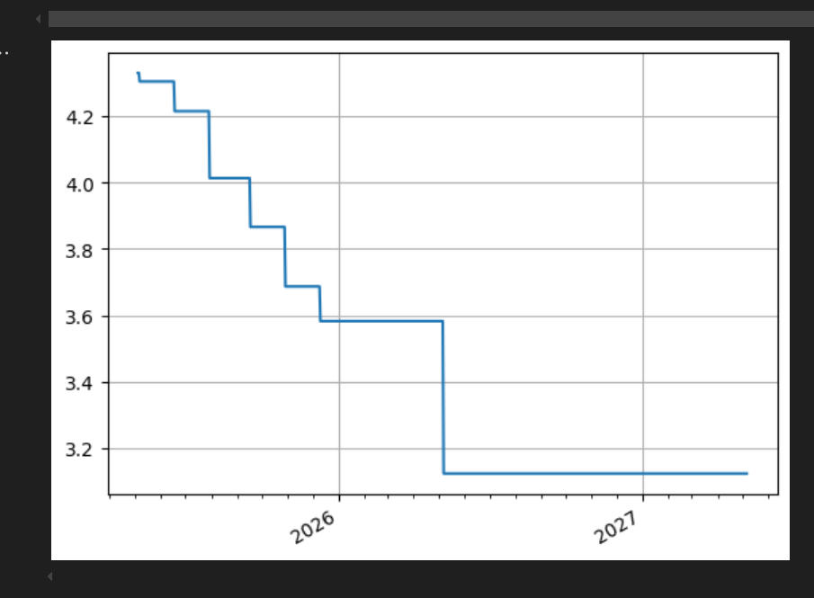

# curve_builder

## TODO
[x] use excel to enter all the data its just easier 
[x] read the excel data into json to be used as curve input?
[ ] build it to be able to accept multiple instrument types from excel
[x] input validation
[ ] integrated new data model into curve builder
[ ] build both a eur and usd curve together
[ ] visualize things a bit better?
[ ] construct an xccy curve!

##achievements

babys first curve

